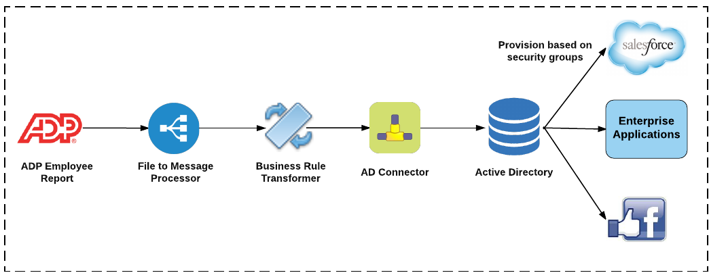

# ADP to AD Integration  

ADP is the leader in business outsourcing services, analytics and compliance expertise. ADP's unmatched experience, deep insights, and cutting-edge technology have transformed human resources from a back-office administrative function to a strategic business advantage. ADP provides HRMS (Human Resource Management Systems), Payroll and Finance critical to business operations of Any company.
  
As organization move to the cloud and to distributed and de-centralized architecture, the key challenge is integrating HR and Payroll data with the rest of the enterprise systems like Identity Management, Resource planning, scheduling and finance systems 
 
Integrating ADP HR and Payroll to rest of the enterprise

##Integrating ADP HR and Payroll to rest of the enterprise

<a href="https://www.robomq.io/">RoboMQ</a> provides connectors to ADP HR and Payroll using ADP-R (ADP Report) tool as input source of information <a href="https://www.robomq.io/index.html#thingsconnect">ThingsConnect</a> suite of adapters and connectors to make ADP data available to and from enterprise systems for payroll processing, Identity Management (including Role Based Access Control (RBAC) and employee life cycle management.

Customers use RoboMQ's ThingsConnect suite for leading-edge integration of devices, enterprise systems, and applications to build automation of manual processes, optimization of their IT environments.

## RoboMQ In Action: ADP to AD Integration Solution

<a href="https://www.robomq.io/">RoboMQ's</a> leading-edge integration capabilities helped a leading global sports entertainment company automate their employee on-boarding and life cycle management by integrating ADP with Active Directory (AD) and automatically provisioning access to enterprise system based on roles and privileges:

* When a new employee starts working at any company location, their information is entered into the company’s ADP HR system.
* For new employees, RoboMQ creates identities in Active Directory and provisions them into enterprise applications based on role or security groups ensuring that each employee has a single and unique account across all systems with associated access levels.
* RoboMQ automatically generates a random password for them along with default attributes and account control settings. It then handles sending welcome or other on-boarding emails to the responsible office manager based on job role and/or location.
* For existing employees, RoboMQ updates account settings, change of roles (i.e promotions, transfer, etc.), or change of status (i.e. long term leave, termination, or re-hire).

By integrating ADP with Active Directory, significant savings result by removing the costly and tedious manual ticket processing, identity creation and access grants by system administrators. This solution also handles automatically creating tickets/cases for audit trails and provides mechanisms for alerts and notification.

Once this solution is implemented the new employee has all the accounts and application access created and he or she is ready to go from the day one!!!

Optionally, organization using Single Sign On (SSO) solutions like <a href="https://www.centrify.com/">Centrify</a> benefit from single sign on and auto provisioning.

ADP to AD Integration enables company IT and HR teams to focus on more strategic business priorities. RoboMQ offers its <a href="https://www.robomq.io/index.html#thingsconnect">ThingsConnect</a> suite as pre-built <a href="https://www.robomq.io/index.html#microservices">Microservices</a> for easy and rapid deployment allowing expandable systems capable of adopting change in the future without having to replace the overall on-boarding or payroll processes.
