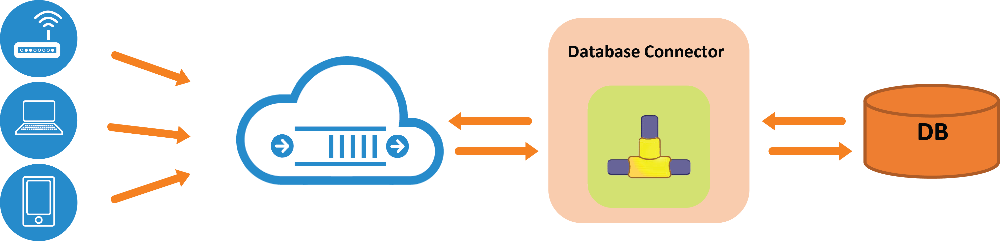

# Database Connector

As Internet of things evolves, these small footprint microprocessor devices with some kind of network connectivity, will join the existing Internet of people, processes and systems. “ThingsConnect” suite of connectors and adapter is positioned to allow these devices on varied platforms to connect to application systems, mobile platforms and enterprise applications through variety of protocols and cross protocol conversion capabilities.

To this end, we have offer **Database connectors for RoboMQ that can allow all the major relational databases to connect to and from RoboMQ middleware platform**.  This connector is tested against Oracle, MySQL and PostgresSQL and it is compatible with any ODBC compliant relational database. That is a long way of saying any relational database…  All you need is an ODBC driver for that particular database.

**Fig 1: Schematic of the Database connector**

What does this really mean for you? At a high level you can include databases and database driven application easily into the integrations using RoboMQ. You could receive messages over RoboMQ using any of MQTT, AMQP, Stomp, WebStomp or REST protocols and persist them into the database. At the same time, you could select information from the database and publish it as a message that could be consumed by clients using any of the above mentioned messaging and integration protocols.  So essentially it is a full two integration of relational databases with robomq.io.

The connector can be run as a client inside the corporate firewall or on the cloud. No firewalls are needed since it makes outbound connections to robomq.io. For the ease of deployment and management it is packaged as a Docker container. You simply get the container and run it. Any future updates are automatically available to you as the updates to the Docker container itself.  You of course have an option to run it as a regular program.

There are some additional details like it supports JSON as well as delimited ASCII data interchange method. The connector also has error handling built in with the provision of the “dead letter” queues. Any messages that cannot be handled are routed to the dead letter queue and can be handled on a case-by-case basis manually by the operations team.

So what are you waiting for? Check out our database connector on our <a href="https://robomq.io/index.html#free">free trial</a>, and let us know your feedback. To learn more about the many other connectors that RoboMQ offerers check back on our connectors page(link)! If you have any other questions please reach out to us as, <a href="mailto:sales@robomq.io">sales@robomq.io</a> and we would love to help.