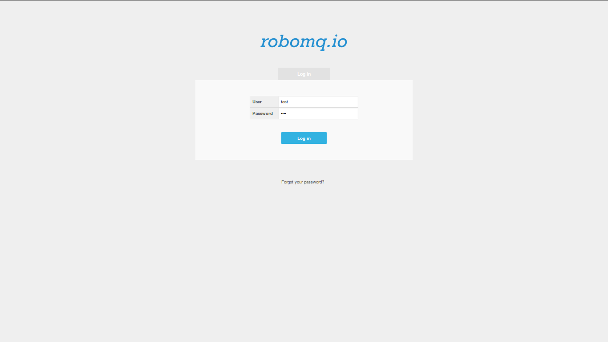
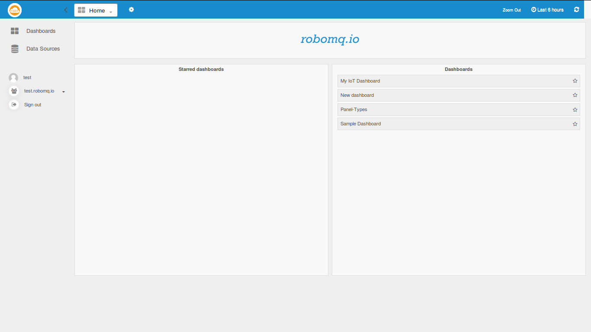
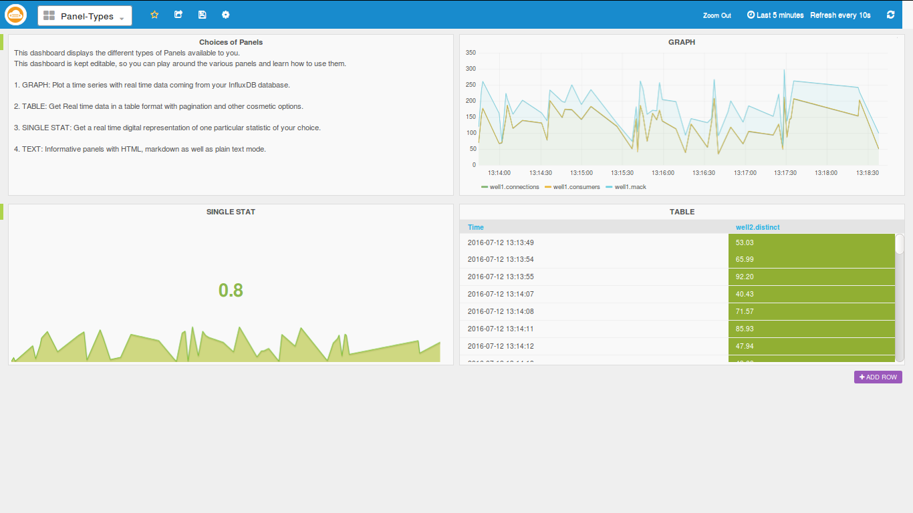
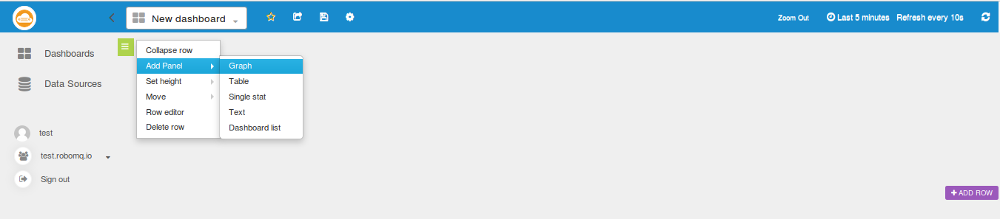
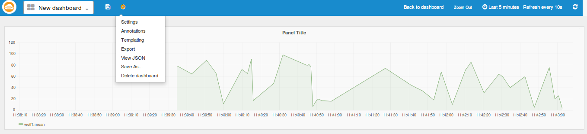
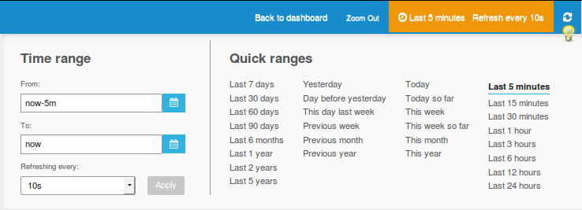

IoT Analytics

## Introduction
In most cases watching is better than reading! While avid novelists might disagree, we in the world of Internet and Things (IoT) would prefer an effective, precise and intelligent visual representation of the plethora of information continuously generated by our beloved sensors.
RoboMQ IoT analytics does exactly this and much more. RoboMQ IoT Analytics helps you efficiently monitor and elegantly represent your data while providing intelligent, selective and crucial information in a simple and legible manner.
Keep a close watch on all your devices, monitor your sensors,  organize your data visualizations and get total and seamless control over your IoT analytics.

* [Overview and advantages](#overview-and-advantages)
* [IoT Analytics Flow](#iot-analytics-flow)
* [IoT Analytics Producer Setup](#iot-analytics-producer-set-up)
* [Familiarize with the UI](#familiarize-with-the-ui)
* [Set Up datasources](#set-up-datasources)
* [Create Dashboards](#create-dashboards)
* [Add Panels](#add-panels)
* [Setup the Panel](#setup-the-panel)
* [Panel Metrics](#panel-metrics)
* [Top Bar](#top-bar)
* [Timeline Editor](#timeline-editor)
* [Final My Dashboard](#final-my-dashboard)

## Overview and advantages

Jack runs a business of providing storages and warehouses for commodity retailers, initially, with a small but growing business he was fine with physically monitoring the warehouses. But as the business grew, so did the complexity of managing it and the sheer scope of parameters and locations to monitor increased as well.

Jack then set up several sensors in his warehouses collecting data like temperature, humidity, movements, luminance, power consumption etc which replaced his age old method of collecting this data manually with specific handheld devices. These new sensors constantly collect the data and send it as messages to [RoboMQ IoT Integration Platform](http://www.robomq.io/). Now all that he needs is an easy to use app to monitor and analyze the data collected by these sensors anywhere and at anytime.
[RoboMQ IoT Analytics](http://www.robomq.io/index.html#iotanalytics) does exactly the same and much more... Jack can visualize his data, follow the trends it takes and manage his business much more effectively with this analytics. He simply opens his RoboMQ IoT Analytics application from his computer, phone or tablet and monitors his warehouses with a few clicks, saving himself a lot of time and money which was spent physically monitoring the warehouses  with help of few employees. Not only the old method time consuming but it could also be inaccurate at times and the constant monitoring was almost impossible.

With IoT Analytics, it’s as easy as it gets. Now he can act on the slightest irregularity in the data, delegate his employees at the right place on the right time all while relaxing in his office, saving effort, money and time. He can also add other users to the application with limited permissions so they can view the data and report or act accordingly.

Simple yet elegant, the [IoT Analytics](http://www.robomq.io/index.html#iotanalytics) allows Jack to get total automated control with no programming needed!!!  A simple producer code is all that is needed to send the data from sensors to the RoboMQ and IoT Analytics takes care of the rest. Jack simply drags and drops the widgets that he wants for visualization and he is all set to go..

## IoT Analytics schematics

The Sensors send data as AMQP, MQTT or STOMP messages to RoboMQ message Broker using a simple producer code.

The IoT Analytics listener constantly listens for these messages and writes to the respective real time analytics database.

The IoT analytics dashboard can easily be built by simple drag and drop of visualization components like  graphs, single-stats or tables with continuous data feed from sensors with guaranteed delivery.

Now that we have seen the flow, let’s dive a bit deeper into IoT Analytics, learn and understand the key components and while at it, help Jack here set up the system for his warehouses.
Let’s start with helping him set up a producer which will send his data to the MQTT broker on RoboMQ. You always have the option to use any other protocol like STOMP, HTTP/REST, AMQP or JMS.

## IoT Analytics Producer Set Up
As per the flow, we will first make a producer for Jack’s devices. Its very simple...

In order to set up Message Producer on devices to see the generated data on your dashboard, you will need to run a 'message producer' script on the devices to send data to RoboMQ. In this guide, we will walk you through a simple producer example.

###Configuration
> To configure the producer to send data to RoboMQ broker, you will need to provide the following information in a JSON format file named producer.config
 

    {
    "deviceID": "well1",
    "broker":
    {
    "host": "trial.robomq.io",
    "vhost": "test",
    "username": "test",
    "password": "test"
    }
    }

deviceID is a unique identifier of a device. Fill out the broker section with your tenant credentials provided by RoboMQ.

###Prerequisites
Producer can talk to RoboMQ using any messaging protocol. In this example, we are using MQTT. The only dependency for the producer is to install an open-source client implementation of MQTT. We will use [paho](http://www.eclipse.org/paho/) from eclipse foundation .
To install paho module on a IoT device, simply run:
> pip install paho-mqtt

Core producer functions are written in python module "producerMQTT.py". This module is used by the program sending device sensor data. It has functions for reading the configuration file, and defines methods for connecting to broker and sending the messages. If not specified, messages will be sent using the default routing key called "sensors".

###Device Simulator
If you have access to a physical device, great...Else you can use a python simulator code for this exercise. With a device you can write a similar producer/sender program like the simulator program described below.

The simulator program "sensorSimulator.py" sends randomly generated data to simulate information sent by the sensor. The script imports producerMQTT module and connect to RoboMQ. This program generates random numbers and assigns them to the measurements like temperature, humidity etc.. This is to simulate a device collecting data from its sensors. In the real world, you will simply write your own code to read data from sensors and put them in the message payload.

    message = {}
    message["intruder"] = random.randint(0, 1)
    message["temperature"] = random.uniform(32, 212)
    message["humidity"] = random.uniform(0, 100)
    message["luminance"] = random.uniform(0, 100)

Once the message payload is constructed, it calls the send() method in producerMQTT to send the above data to RoboMQ.

## Build Analytics dashboard
### Familiarize with the UI
 Once you are provisioned for the trial or a paid subscription to RoboMQ, you get an email with login credentials and the links to the IoT Analytics application. The link will be something like the following: https://trial.robomq.io/iotanalytics/
 
 Once you click on it, you will be redirected to the following login page. If you have not signed up, you can sign up for a [free trial](http://www.robomq.io/index.html#free) at RoboMQ website.

####Login page

Following is the main page seen after you log in. The Home page has 3 major sections:

1. **Main menu**: On left hand side we see the main control menu which contains options such as Datasources, Dashboards, User Profile, Organization and Sign Out link.
2. **Navigation Bar**: On the top, we see the blue navigation bar which has the timeline editor and few other options and settings related to the dashboards.
3. **Dashboard List**: The most prominent section you will  see here is the dashboard list, which allows the user to bookmark a few dashboards for quick access. These chosen dashboards will be shown under the "Starred" Dashboards section.

#### Main page

>Your RoboMQ IoT Analytics comes provisioned with a datasource, two dashboards - one a "Panel Type" and another "Sample Dashboard"

####Panel Types dashboard

Panel type dashboard is there to show the different types of panels available in the app. Since the dashboard is editable, feel free to play around and get familiar with the components of the panels.

####Sample Dashboard

Sample dashboard is a large dashboard containing panels of all kinds of graphs, which we will use to play around and get ideas for making our own dashboards.

**Now let’s make a simple dashboard with the following steps:**

### Set Up the datasources
The datasources are the source of data from which the application plots the graphs and widgets. It is a real time time-series database to which RoboMQ listeners are continuously pumping your sensor data. We have got you covered here, because we have included a complete datasource for you and it is named after your vhost or tenant ID.

### Create Dashboards
Now we can go ahead and create a new dashboard as shown in the image below by clicking "Home" button followed by "+NEW" button

**Create Dashboard**

### Add Panels

Once we have created an empty dashboard, we can add row using the "ADD ROW" button and in each row we can add panels using the green button on the left-top-corner of each row. The following image illustrates it, in the example below we are creating a panel of type graph.

**Create Panel**

### Setup the Panel
As we can see in the images below, the panel setup has several tabs-

1. **General:**  General defines parameters like name of the panel, the span that it should cover in the row, height etc.
2. **Metrics:** Metrics is the key tab which defines what metric, measurement or query the panel is to display.
3. **Axes & Grid:** Here we can customize how the graph looks, we can name the axes, change the units on the Y axes, add visual thresholds etc.   
4. **Display Styles:** This tab can be used to define how the graph lines look. Its very useful when we have many series in the same panel.
5. **Time Range:** Time range can be used to define offsets in time Axis relative to the timeline defined by the timeline Editor available at the Nav bar.

**Panel Setup**

>
 
### Panel Metrics
In the above images, we can see the control is already in the metrics tab. First chose which datasource we are getting the data from, simply choose the one we have made for you named after your tenant name.
Now choose which measurement to read from at "FROM", it will automatically populate a list of measurements available from your datasource.
After choosing the measurement, chose the field that you are looking for at "SELECT”. The UI will automatically list all existing fields under the above selected measurement for you to chose from.

###Save the dashboard and set the timeline
Now you are almost done and ready to save the dashboard and set the timeline.

#### Top Bar

You can create as many panels and rows as setup above. Setup and ensure effective visualization of the required metrics or measurements.

**Save the dashboard by clicking on the save icon on the top nav bar.** If needed, we can also delete the dashboard from the settings icon.

### TimeLine Editor
In the image below, we see the timeline Editor at the right side corner of the top nav-bar. This lets us scale the time axis as per our requirement giving us a viewing range of as early a last five minutes to as long as past 5 years.

In the timeline editor, we see the ranges it provides and also the refresh setup that refreshes the panels after the set interval. The icon marked by the light bulb sign refreshes the timeline when you click it.

## Finally your IoT dashboard

Above we see the final example dashboard which monitors the different sensors in two Warehouses.

This is just a brief introduction to the unlimited potential IoT Analytics brings for the customers using IoT devices in their business. You can correlate and visualize your device and sensor data with few clicks and no programming needed...

Feel free to browse through the IoT Analytics and explore the application. If you would like to try IoT Analytics for yourself go to our website and request a free trial [free trial](http://robomq.io/index.html#free).

For more information on RoboMQ and its product features, check out our website [robomq.io](https://robomq.io/) or email us at sales@robomq.io.  

