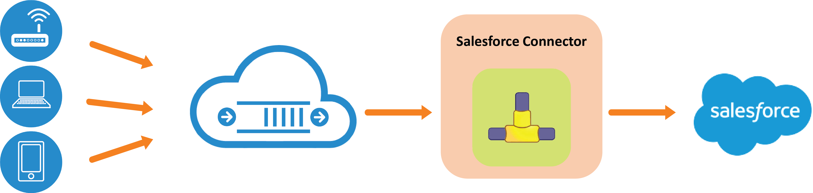

# RoboMQ - Salesforce Connector

One of the many platform with which RoboMQ is able to provide a connector is the popular customer relationship management platform, Salesforce. Salesforce has been part of our suite of connectors and adapters called “<a href="https://www.robomq.io/#thingsconnect">ThingsConnect</a>” since the early days of our product. With this growing suite of adapter and connectors, RoboMQ is truly an <a href="https://www.robomq.io/#iotmiddleware">Internet of Things (IoT) middleware</a> platform that can connect any device to any application.

Salesforce.com is one representative platform, where the devices and device networks can create cases to engage support and field operations teams to react to the issues and events of interest. IoT (Internet of Things) devices integrating with Salesforce.com and its workflowmanagement components will not only be valuable for reacting to the problem but they can also create new business opportunities by providing meaningful business information. This is really the essence of Internet of Things by making devices and sensors a.k.a. “things” become other players in addition to people, systems and processes

Using RoboMQ Salesforce connector, a customer’s device or sensor can integrate Salesforce.com into its device management and diagnostics flow. This makes sense for an organizations using Salesforce.com where cases are typically used to engage technical support and triage teams to react to an issue or an incident. Another common use case is to receive and integrate the information from sensors or “things” into the business workflows in Salesforce.com. This could be a powerful paradigm in a world where device and beacons with local intelligence are becoming a commonplace.

**Fig 1: Schematics of the Salesforce connector**

The robomq.io Salesforce connector creates a seamless integration between the devices and Salesforce.com. Based on the context, the identity, and the nature of the information from the devices and sensors, the connector can be configured to create cases for a particular division or the group within an organization. This association is configurable and highly flexible including the mapping of the data elements from the device to the case being created.

Why use a connector to Salesforce? Yes, you can create cases manually from the “Cases” tab in the Salesforce.com graphical user interface. But this means someone has to become aware of the issue and has to act upon it. This is not only prone to mistakes but valuable time is lost before someone can look into the issue. And hello… why are we investing into the devices and sensors in the first place? To make processes faster, reduce cost and get things done cheaper using cheap microprocessors vs. costly human resources. Right?

And that’s where the value comes in – robomq.io Salesforce connector offers tremendous efficiency in having the ability to create cases automatically within a customer’s existing workflow. In addition, as a core feature of robomq.io, it ensures the guaranteed and reliable delivery of the information through its robust and scalable IoT middleware infrastructure.

With businesses, small to large and local to global, increasingly relying on sensors and devices to collect information from the environment and making decisions upon it, the need to build a network of intelligent, self-healing and proactive “things” is a paramount one!! To learn more about the many other connectors that RoboMQ offerers check back on our connectors page(link)! If you have any other questions please reach out to us as, <a href="mailto:sales@robomq.io">sales@robomq.io</a> and we would love to help.