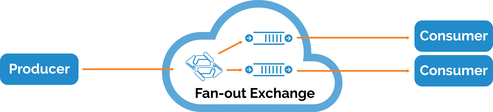

# Broadcast (Publish/Subscribe)

For broadcast messaging, a producer sends messages to fan-out exchange that are broadcast to all queues bound to that exchange.  As soon as a consumer subscribes to the queue, messages will be delivered to that consumer

----------

## Python
If we have more than one consumer and they are listening to the different queues, they will all receive same messages sent by one producer. 

### Producer
First, producer should initialize the connection to the [robomq.io](http://www.robomq.io) server and initialize a channel for communication. 

	connection = pika.BlockingConnection(pika.ConnectionParameters(
        host='your port'))

Then producer should declare a **fanout** type exchange for delivering message. 

	channel.exchange_declare(exchange='exchangeName',
                         type='fanout')

Fanout type exchange will deliver all messages to all queues bound to it. 
After initializing the exchange, producer should publish messages to this exchange. Since this is **fanout** type, producer should leave routing key empty. 

	channel.basic_publish(exchange='exchangeName',
                      routing_key='',
                      body=message)

Finally, after publishing all messages, producer should terminate the connection. 

	connection.close()

###Consumer
First, consumer should initialize connection to the [robomq.io](http://www.robomq.io) server. 

After that, consumer should initialize an exchange exactly as producer did. (<b>type</b> and <b>name</b> should be exactly same)

	channel.exchange_declare(exchange='exchangeName',
							type='fanout')

Then consumer should initialize a queue and bind this queue to the exchange. It will receive all the messages sent to this exchange.  With a **fanout** type exchange, more than one consumer or a consumer with any number of separate queues can bind to it and start consuming the same messages. 
	
	queue_name = 'queueName'
	channel.queue_declare(queue=queue_name,exclusive=True)
	channel.queue_bind(exchange='exchangeName',
                   queue=queue_name)

Consumer could also define a callback function as one-to-one section explained. 
At this point, consumer should start consuming messages.

	channel.basic_consume(callback,
                      queue=queue_name,
                      no_ack=True)
	channel.start_consuming()

###Putting it all together

**producer.py**

	import pika
	import sys

	connection = pika.BlockingConnection(pika.ConnectionParameters( host='your port'))
	channel = connection.channel()

	channel.exchange_declare(exchange='exchangeName', type='fanout')

	message = 'hello world'
	channel.basic_publish(exchange='exchangeName', routing_key='', body=message)
	print 'Sent %r' % (message,)
	connection.close()

**consumer.py**

	import pika

	connection = pika.BlockingConnection(pika.ConnectionParameters(host='your host'))
	channel = connection.channel()

	channel.exchange_declare(exchange='exchangeName',
                         type='fanout')

	queue_name = 'queueName'
	channel.queue_declare(queue=queue_name,exclusive=True)
	channel.queue_bind(exchange='exchangeName',
                   queue=queue_name)
	print 'Waiting for logs. To exit press CTRL+C'

	def callback(ch, method, properties, body):
		print '%r' % (body,)

	channel.basic_consume(callback, queue=queue_name, no_ack=True)

	channel.start_consuming()

## Java
### Producer
First, producer should initialize the connection to the [robomq.io](http://www.robomq.io) server and initialize a channel for communication.  

	ConnectionFactory factory = new ConnectionFactory();
	factory.setUsername(userName);
	factory.setPassword(password);
	factory.setVirtualHost(virtualHost);
	factory.setHost(hostName);
	factory.setPort(portNumber);
	Connection conn = factory.newConnection();
	Channel channel = connection.createChannel();

Then producer should declare a **fanout** type exchange for delivering message. 

	channel.exchangeDeclare(EXCHANGE_NAME, 'fanout');

Fanout type exchange will deliver all messages to all queues bound to it. 
After initializing the exchange, producer should publish messages to this exchange. Since this is **fanout** type, producer should leave routing key empty. 

	channel.basicPublish(EXCHANGE_NAME, '', null, message.getBytes());

Finally, after publishing all messages, producer should terminate the connection. 

	channel.close();
	connection.close();

###Consumer
For broadcast consumer, first they should start a connection to the [robomq.io](http://www.robomq.io) server. 

After that, consumer should initializes an exchange same as producer did. (their <b>type</b> and <b>name</b> should be exactly same)

	channel.exchangeDeclare("exchangeName", "fanout");

Then consumer should initialize a queue and bind this queue to the exchange. It will receive all the messages send to this exchange. 

	channel.exchangeDeclare(EXCHANGE_NAME, 'fanout');
	String queueName = channel.queueDeclare().getQueue();
	channel.queueBind(queueName, EXCHANGE_NAME, '');

Consumer could also define a callback function as one to one section mentioned. 
Now, consumer could define consuming method and start consuming messages. 

	QueueingConsumer consumer = new QueueingConsumer(channel);
	channel.basicConsume(queueName, true, consumer);

Then you can define a loop to handle the messages got received. Here we provide an example which use infinite loop to keep consuming message and print it out. 

	while (true) {
		QueueingConsumer.Delivery delivery = consumer.nextDelivery();
		String message = new String(delivery.getBody());
		System.out.println(" [x] Received '" + message + "'");
	}

Binding between same pair of exchange and queue can be initialized more than one times. One queue can bind to more than one exchanges and one exchange can be bound with more than one queues. 

###Putting it all together

**producer.java**

	import java.io.IOException;
	import com.rabbitmq.client.ConnectionFactory;
	import com.rabbitmq.client.Connection;
	import com.rabbitmq.client.Channel;
	
	public class Producer {
		private static final String EXCHANGE_NAME = 'excahngeName';
		public static void main(String[] args)
		throws java.io.IOException {
			ConnectionFactory factory = new ConnectionFactory();
			factory.setHost('your host');
			Connection connection = factory.newConnection();
			Channel channel = connection.createChannel();

			channel.exchangeDeclare(EXCHANGE_NAME, 'fanout');
       
			String message = 'hello world';

			channel.basicPublish(EXCHANGE_NAME, '', null, message.getBytes());
			System.out.println("Sent '" + message + "'");

			channel.close();
			connection.close();
		}
	}
	
**consumer.java**

	import java.io.IOException;
	import com.rabbitmq.client.ConnectionFactory;
	import com.rabbitmq.client.Connection;
	import com.rabbitmq.client.Channel;
	import com.rabbitmq.client.QueueingConsumer;

	public class Consumer {
		private static final String EXCHANGE_NAME = 'exchangeName';

		public static void main(String[] argv)
			throws java.io.IOException,java.lang.InterruptedException {
    	
			ConnectionFactory factory = new ConnectionFactory();
			factory.setHost('your host');
			Connection connection = factory.newConnection();
			Channel channel = connection.createChannel();

			channel.exchangeDeclare(EXCHANGE_NAME, 'fanout');
			String queueName = channel.queueDeclare().getQueue();
			channel.queueBind(queueName, EXCHANGE_NAME, '');

			System.out.println('Waiting for messages. To exit press CTRL+C');

			QueueingConsumer consumer = new QueueingConsumer(channel);
			channel.basicConsume(queueName, true, consumer);

			while (true) {
				QueueingConsumer.Delivery delivery = consumer.nextDelivery();
				String message = new String(delivery.getBody());
				System.out.println('Received '' + message + ''');
			}
		}
	}

## Node.js
### Producer
First, producer should initialize the connection to the [robomq.io](http://www.robomq.io) server and initialize a channel for communication. 

	var connection = amqp.createConnection({ host: "your host", port: 5672,  
	login:'username', password:'password', vhost:'vhost-name' });
	
Then producer should declare a **fanout** type exchange for delivering message.

Then producer should subscribe an exchange for delivering message. The type of exchange should be fanout. Fanout type exchange will deliver all messages to all queues which binding to it. 

After initialized the exchange, producer should publishing the message to this exchange. Since this is fanout-type exchange, producer should leave routing key empty. Fanout type exchange will deliver all messages to all queues which binding to it. 

After initialized the exchange, producer should publishing the message to this exchange. Since this is fanout-type exchange, producer should leave routing key empty. 

	connection.on('ready',function(){
		connection.exchange('exchangeName', options={type:'fanout', autoDelete:false}, function(exchange){
			console.log('start send message');
			exchange.publish('routingKey','hello world');
		});
	});	

###Consumer
First, consumer should initialize connection to the [robomq.io](http://www.robomq.io) server.  

After that, consumer should initializes an exchange same as producer did. 
Then consumer should initialize a queue and bind this queue to the exchange. It will receive all the messages send to this exchange. 

Consumer could also define a callback function as one to one section mentioned. 
Now, consumer could define consuming method and start consuming messages. 

	connection.on('ready', function(){
		connection.exchange('exchangeName', options={type:'fanout', autoDelete:false}, function(exchange){
			var queue = connection.queue('QueueName', options={},function(queue){
				console.log('Declare one queue, name is ' + queue.name);
				queue.bind('exchangeName', '');
				queue.subscribe(function (msg){
					console.log('consumer received the message'+msg.data);
				});
			});
		});
	});

Binding between same pair of exchange and queue can be initialized more than one times. One queue can bind to more than one exchanges and one exchange can be bound with more than one queues. 

###Putting it all together

**producer.js**

	var amqp = require('amqp');
	var connection = amqp.createConnection({ host: 'your host', port: 'port' });

	connection.on('ready',function(){
		connection.exchange('exchangeName', options={type:'fanout', autoDelete:false}, function(exchange){
			console.log('start send message');
			exchange.publish('routingKey','hello world');
		});
	});

**consumer.js**

	var amqp = require('amqp');
	var connection = amqp.createConnection({ host: 'your host', port: 'port' });

	connection.on('ready', function(){
		connection.exchange('exchangeName', options={type:'fanout', autoDelete:false}, function(exchange){
			var queue = connection.queue('QueueName', options={},function(queue){
				console.log('Declare one queue, name is ' + queue.name);
				queue.bind('exchangeName', '');
				queue.subscribe(function (msg){
					console.log('consumer received the message'+msg.data);
				});
			});
		});
	});

## C
### Prerequisites

**C client AMQP library**

RoboMQ is built on AMQP, an open, general-purpose protocol for messaging. There are a number of clients for AMQP in many different languages.  However, we'll choose a simple C-language AMQP client library written for use with v2.0+ of the RabbitMQ broker.

[https://github.com/alanxz/rabbitmq-c/tree/master/librabbitmq](https://github.com/alanxz/rabbitmq-c/tree/master/librabbitmq)

Download the client library package, and copy it into your working directory:

	cp librabbitmq ./

Note that these examples provide a simple client implementation to get started but does not go into detailed description of all flags passed into the AMQP methods. 
A complete reference to RabbitMQ's implementaton of version 0-9-1 of the AMQP specification can be found in this guide.
[https://www.rabbitmq.com/amqp-0-9-1-reference.html](https://www.rabbitmq.com/amqp-0-9-1-reference.html)

### Producer
For broadcast messaging, the producer should publish messages to the the **fanout** type exchange that broadcasts all the messages it receives to all the queues bound to it.  Therefore, routing_key is not required in this example.

	amqp_basic_properties_t props;
	props._flags = AMQP_BASIC_CONTENT_TYPE_FLAG | AMQP_BASIC_DELIVERY_MODE_FLAG;
	props.content_type = amqp_cstring_bytes("text/plain");
	props.delivery_mode = 1; /* non-persistent delivery mode */
	amqp_boolean_t mandatory = 0;
	amqp_boolean_t immediate = 0;
	char exchange_name[] = "fanout-exchange";
	char routing_key[] = "";
	int result;
	
	// Sending message
	result = amqp_basic_publish(conn,
			channel,
			amqp_cstring_bytes(exchange_name),
			amqp_cstring_bytes(routing_key),
			mandatory,
			immediate,
			&props,
			amqp_cstring_bytes("Hello"));

### Consumer
Then the consumer should create an exchange and subscribe to a queue.  This exchange will be defined similarly to the one-to-one example, however, the **fanout** exchange type is specified below as **exchange_type** and binding_key is not required.

	amqp_bytes_t queue;
	amqp_channel_t channel = 1;
	amqp_boolean_t passive = 0;
	amqp_boolean_t durable = 0;
	amqp_boolean_t exclusive = 0;
	amqp_boolean_t auto_delete = 1;
	char exchange_name[] = "fanout-exchange";
	char exchange_type[] = "fanout";
	char queue_name[] = "hello-queue";
	char binding_key[] = "";
	
	// Declaring exchange
	amqp_exchange_declare(conn, channel, amqp_cstring_bytes(exchange_name), amqp_cstring_bytes(exchange_type),
			passive, durable, amqp_empty_table);
	
	// Declaring queue
	amqp_queue_declare_ok_t *r = amqp_queue_declare(conn, channel, amqp_cstring_bytes(queue_name),
			passive, durable, exclusive, auto_delete, amqp_empty_table);

	queue = amqp_bytes_malloc_dup(r->queue);
	
	// Binding to queue
	amqp_queue_bind(conn, channel, queue, amqp_cstring_bytes(exchange_name), amqp_cstring_bytes(binding_key),
			amqp_empty_table);

At this point, consumer should start consuming messages broadcast from the **fanout** exchange type.

### How to build/run client
Now we have two c files, one is producer.c, another is consumer.c. 
(1) Use the Makefile in sdk repository to compile under a Linux terminal. 
(2) cd to the directory which containing client source code 
(3) Run make all

### Putting it all together
The full code below includes some basic AMQP error handling for consumer that is useful when declaring exchanges and queues.

**producer.c**

	#include <stdlib.h>
	#include <stdio.h>
	#include <string.h>
	
	#include <amqp_tcp_socket.h>
	#include <amqp.h>
	#include <amqp_framing.h>
	
	amqp_connection_state_t mqconnect() {
	
		amqp_connection_state_t conn = amqp_new_connection();
		amqp_socket_t *socket = NULL;
		char hostname[] = "hostname"; // robomq.io hostname
		int port = 5672; //default
		char user[] = "username"; // robomq.io username
		char password[] = "password"; // robomq.io password
	    char vhost[] = "vhost"; // robomq.io account vhost
		amqp_channel_t channel = 1;
		int channel_max = 0;
		int frame_max = 131072;
		int heartbeat = 0;
		int status = 0;
	
		// Opening socket
		socket = amqp_tcp_socket_new(conn);
	
		status = amqp_socket_open(socket, hostname, port);
		if (status) {
			printf("Error opening TCP socket, status = %d, exiting.", status);
		}
	
		amqp_login(conn, vhost, channel_max, frame_max, heartbeat, AMQP_SASL_METHOD_PLAIN, user, password);
		amqp_channel_open(conn, channel);
	
		return conn;
	}
	
	int main(int argc, char const *const *argv)
	{
		amqp_connection_state_t conn;
		amqp_channel_t channel = 1;
		amqp_basic_properties_t props;
		props._flags = AMQP_BASIC_CONTENT_TYPE_FLAG | AMQP_BASIC_DELIVERY_MODE_FLAG;
		props.content_type = amqp_cstring_bytes("text/plain");
		props.delivery_mode = 1; /* non-persistent delivery mode */
		amqp_boolean_t mandatory = 0;
		amqp_boolean_t immediate = 0;
		char exchange_name[] = "fanout-exchange";
		char routing_key[] = "";
		int result;
	
		conn = mqconnect();
	
		// Sending message
		result = amqp_basic_publish(conn,
				channel,
				amqp_cstring_bytes(exchange_name),
				amqp_cstring_bytes(routing_key),
				mandatory,
				immediate,
				&props,
				amqp_cstring_bytes("Hello"));
	
		// Closing connection
		amqp_channel_close(conn, channel, AMQP_REPLY_SUCCESS);
		amqp_connection_close(conn, AMQP_REPLY_SUCCESS);
		amqp_destroy_connection(conn);
	
		return 0;
	}

**consumer.c**

	#include <stdlib.h>
	#include <stdio.h>
	#include <string.h>
	
	#include <amqp_tcp_socket.h>
	#include <amqp.h>
	#include <amqp_framing.h>
	
	amqp_connection_state_t mqconnect() {
	
		amqp_connection_state_t conn = amqp_new_connection();
		amqp_socket_t *socket = NULL;
		char hostname[] = "hostname"; // robomq.io hostname
		int port = 5672; //default
		char user[] = "username"; // robomq.io username
		char password[] = "password"; // robomq.io password
		char vhost[] = "vhost"; // robomq.io account vhost
		amqp_channel_t channel = 1;
		int channel_max = 0;
		int frame_max = 131072;
		int heartbeat = 0;
		int status = 0;
	
		// Opening socket
		socket = amqp_tcp_socket_new(conn);
	
		status = amqp_socket_open(socket, hostname, port);
		if (status) {
			printf("Error opening TCP socket, status = %d, exiting.", status);
		}
	
		amqp_login(conn, vhost, channel_max, frame_max, heartbeat, AMQP_SASL_METHOD_PLAIN, user, password);
		amqp_channel_open(conn, channel);
	
		return conn;
	}
	
	amqp_bytes_t mqdeclare(amqp_connection_state_t conn) {
		amqp_bytes_t queue;
		amqp_channel_t channel = 1;
		amqp_boolean_t passive = 0;
		amqp_boolean_t durable = 0;
		amqp_boolean_t exclusive = 0;
		amqp_boolean_t auto_delete = 1;
		char exchange_name[] = "fanout-exchange";
		char exchange_type[] = "fanout";
		char queue_name[] = "hello-queue";
		char binding_key[] = "";
		amqp_rpc_reply_t reply;
	
		// Declaring exchange
		amqp_exchange_declare(conn, channel, amqp_cstring_bytes(exchange_name), amqp_cstring_bytes(exchange_type),
				passive, durable, amqp_empty_table);
	
		reply = amqp_get_rpc_reply(conn);
		if(reply.reply_type != AMQP_RESPONSE_NORMAL) {
			amqp_connection_close_t *m = (amqp_connection_close_t *) reply.reply.decoded;
			fprintf(stderr, "%s: server connection error %d, message: %.*s\n",
					"Error declaring exchange",
					m->reply_code,
					(int) m->reply_text.len, (char *) m->reply_text.bytes);
			exit(1);
		}
	
		// Declaring queue
		amqp_queue_declare_ok_t *r = amqp_queue_declare(conn, channel, amqp_cstring_bytes(queue_name),
				passive, durable, exclusive, auto_delete, amqp_empty_table);
	
		reply = amqp_get_rpc_reply(conn);
		if(reply.reply_type != AMQP_RESPONSE_NORMAL) {
			amqp_connection_close_t *m = (amqp_connection_close_t *) reply.reply.decoded;
					fprintf(stderr, "%s: server connection error %d, message: %.*s\n",
							"Error declaring queue",
							m->reply_code,
							(int) m->reply_text.len, (char *) m->reply_text.bytes);
			exit(1);
		}
		queue = amqp_bytes_malloc_dup(r->queue);
	
		// Binding to queue
		amqp_queue_bind(conn, channel, queue, amqp_cstring_bytes(exchange_name), amqp_cstring_bytes(binding_key),
				amqp_empty_table);
	
		return queue;
	}
	
	int main(int argc, char const *const *argv)
	{
		amqp_connection_state_t conn;
		amqp_bytes_t queue;
		amqp_channel_t channel = 1;
		amqp_boolean_t no_local = 0;
		amqp_boolean_t no_ack = 1;
		amqp_boolean_t exclusive = 0;
		amqp_frame_t frame;
	
		conn = mqconnect();
		queue = mqdeclare(conn);
	
		// Consuming the message
		amqp_basic_consume(conn, channel, queue, amqp_empty_bytes, no_local, no_ack, exclusive, amqp_empty_table);
	
		while (1) {
			amqp_rpc_reply_t result;
			amqp_envelope_t envelope;
	
			amqp_maybe_release_buffers(conn);
			result = amqp_consume_message(conn, &envelope, NULL, 0);
	
			if (AMQP_RESPONSE_NORMAL == result.reply_type) {
	
				printf("Received message size: %d\nbody: %s\n", envelope.message.body.len, envelope.message.body.bytes);
	
				amqp_destroy_envelope(&envelope);
			}
		}
	
		// Closing connection
		amqp_channel_close(conn, channel, AMQP_REPLY_SUCCESS);
		amqp_connection_close(conn, AMQP_REPLY_SUCCESS);
		amqp_destroy_connection(conn);
	
		return 0;
	}

