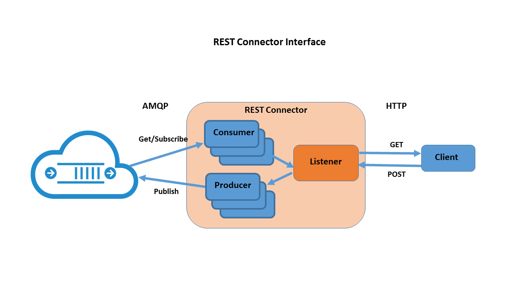

# Salesforce Connector

This section introduces you to the Salesforce Connector providing an API between your client applications/devices and Salesforce account.

The Salesforce connector currently supports **Salesforce Case Create** requests with AMQP transactions processed through the [robomq.io](http://www.robomq.io) broker.  The incoming AMQP playload consists of attributes necessary to create and assign a case (i.e. subject, description, contact name, etc.).  NOTE- additional record types may be supported in the future.

###Overview:

A Salesforce customer may have one or more users/divisions within their organization.  The connector is designed as a planned part of their business model, given they may wish to utilize an automated process to create/update case entries in Salesforce.

The Salesforce connector makes it simple for client device/applications specified by customer to automatically create cases through robomq.io.  Case fields are auto-populated in Salesforce when a device issues an alarm, defect, etc. through the broker or AMQP destination queue.  The  connector/consumer instance receives case requests, identifies the source of the incoming message, maps to a destination Salesforce user, and create a case record that will be assigned to that user account according to attributes sent in payload. 

The Connector is intended for installation/execution on the customer site/platform.  With multiple Salesforce tenants existing per organization, each is represented on the connector by a listening **"consumer"**  all listening over AMQP simultaneously for case request messages.

###Startup Authentication Process:

Before the connector can start processing any case requests, an access token must be provided by the Salesforce authentication server.

- The connector requests authorization on behalf on tenant providing username and password, then server verifies credentials and responds with access token.
- The connector obtains the access token and submits with all subsequent requests.

###Configuration:
The connector configuration is a JSON formatted file simply requiring definition of 2 sections, "tenant" and "divisions":

- Tenant section:
	- Salesforce client Id and secret for remote API access,
	- AMQP connection parameters and credentials.
- Divisions section:
	-  Salesforce user/division credentials
	-  Default case record attributes
	-  AMQP exchange, queue, and/or routing key.

###Execution:
The connector is provided as an executable script compatible with Python 2.7 and above.  Starting it simply requires passing the pre-defined configuration file as an argument as shown in example below:

	python SFconnector.py -i config.json

# DB Connector
 
This section introduces you to the DB Connector providing an API between your client applications/devices and back-end database. 

[robomq.io](http://www.robomq.io) has built a DBConnector module in Python. It consists of an interface between AMQP broker and backend database supporting these transactions:

1. SQL Select & AMQP Publish
2. AMQP Get & SQL Insert

###Overview:

1. DBConnector is easily installed, configured and run on client platform, so there's no privacy hazard to your database.   
2. DBConnector is configured to use one logical database. All SQL Select and Insert transactions are supported within the database.  
3. On the AMQP side, DBConnector will publish to a destination exchange and get messages from a source queue.   
4. Each Select&Publish transaction consists of one AMQP message per database record (row).  
5. Each Get&Insert transaction consists of one or multiple insert statements per AMQP message.  
6. Database records can be translated to / from AMQP in either delimited text or JSON array. You can specify any delimiter if use delimited text.  
7. If the destination exchange, source exchange & queue don't exist, DBConnector will create them with the default settings.  
8. All the methods of DBConnector returns True, False or None, which respectively indicates success, failure or empty result. Empty result happens when the source queue is empty or select query returns 0 row.  
9. Messages fail to process be "dead lettered". You can find them in the dead letter queue and deal with them as you want.  
10. DBConnector handles all possible exceptions to prevent your invoker process from being interrupted. It will print the error or warning and write log if you have enabled logging.   

###Prerequisite:

1. Install python-pyodbc and the ODBC driver for selected database.
2. Create dead letter queue in your vhost with the script `deadLetterQueue.py` provided by [robomq.io](http://www.robomq.io). Get the help session for detailed usage.  

		python deadLetterQueue.py -?

###Configuration:

The configuration file is written in JSON format. It consists of 3 major sections, "database", "broker" and "format".

- Database section:
	- access information of the database,
	- query statement or template.
- Broker section:
	-  AMQP connection parameters and credentials,
	-  exchange or queue as message source and destination.
- Format section:
	-  message is delimited text or JSON array,
	-  if delimited, specify the delimiter. 

###Execution:

After loading the configuration, two major methods you'll invoke are `DBToMQ()` and `MQToDB()`.  

1. `DBToMQ()` executes a select query in database and publish each row of the result as a message to the destination exchange.  
2. `MQToDB()` gets a message from the source queue, from which extracts the values and insert one record or multiple records into the database.  

Putting it together, a simple example program would be,    

	import DBConnector

	print "1. load config: %s" % str(DBConnector.loadConfig("DBConnector.config"))
	print "2. select & publish: %s" % str(DBConnector.DBToMQ())
	print "3. get & insert: %s" % str(DBConnector.MQToDB())

# REST Adapter

This section introduces you to the REST adapter providing an API between your client applications and publishers/subscribers connected to your AMQP virtual host. 

