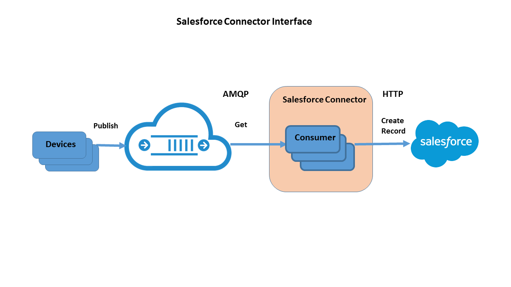
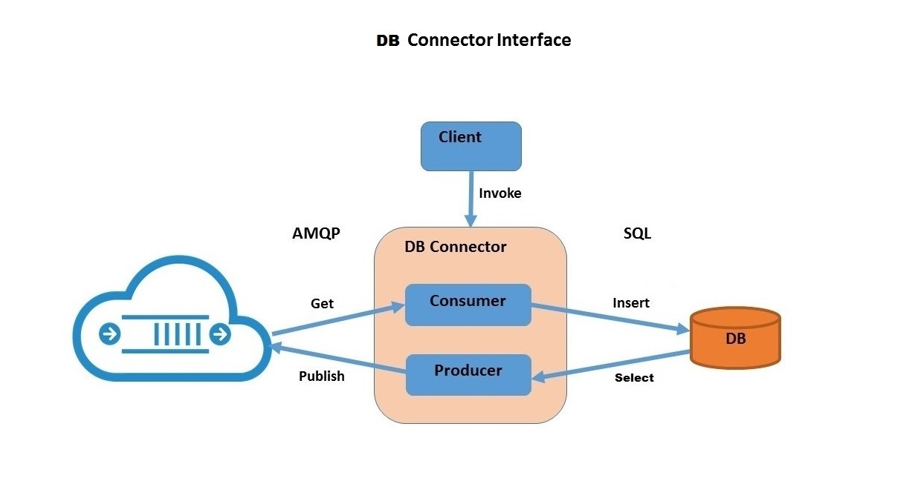

# Salesforce Connector

This section introduces you to the Salesforce Connector providing an interface between client devices/sensors and an customer's existing Salesforce workflow.  The [connector](http://www.robomq.io/#thingsconnect) utilizes the [robomq.io](http://www.robomq.io) to ensure the guaranteed and reliable delivery of case information.

**Overview:**

A Salesforce customer may have one or more users/divisions within their organization.  Therefore, connector can be configured to create cases for more than one division or group within the organization based on the nature of the information or defect from the device or sensor.

The connector is designed to integrate seamlessly into the customer's existing management or diagnostics workflow in Salesforce.com allowing case creation to be automated.  This offers tremendous efficiency in reducing cost and valuable time without human intervention required to act upon and manually create each case.



**Startup Authentication Process:**

Before the connector can start processing any case requests, an access token must be provided by the Salesforce authentication server.

- The connector requests authorization on behalf on tenant providing username and password, then server verifies credentials and responds with access token.
- The connector obtains the access token and submits with all subsequent requests.
- If invalid user credentials are provided or other error prevents token from being issued, the user cannot authorize the connector to access Salesforce API in this flow.

**Connector Operation:**

- The Salesforce connector currently supports **Salesforce Case Create** requests.
- Devices/sensors issue case requests messages over AMQP through the robomq.io broker.
- The connector identifies the source of the incoming message, determines the destination Salesforce user/division, and creates a case record associated with their account.
- The incoming AMQP playload consists of all elements necessary to create and assign a case (i.e. subject, description, contact name, etc.).
- Mapping of the data elements from the device to the case attributes is configuration driven.

**Configuration:**

The connector configuration mapping is a JSON formatted file requiring definition of 2 sections, "tenant" and "divisions" as follows:

- Tenant section:
	- Salesforce client Id and secret for remote API access,
	- AMQP connection parameters and credentials.
- Divisions section:
	-  Salesforce user/division credentials
	-  Default case record attributes
	-  AMQP exchange, queue, and/or routing key.

**Prerequisite:**

1.  Requires Python 2.7 and above.
2.  Install [simple-salesforce](https://pypi.python.org/pypi/simple-salesforce) REST API client.
2. Create dead letter queue in your vhost with the script `deadLetterQueue.py` provided by [robomq.io](http://www.robomq.io). Get the help session for detailed usage.  

```bash
python deadLetterQueue.py -?
```
**Execution:**

The Connector is intended for installation/execution either on the customer's enterprise platform or hosted on a supported cloud platform.
Starting it simply requires specifying the configuration mapping file as shown in example below:

```bash
python SFconnector.py -i config.json
```

# Database Connector
 
This section introduces you to the DB Connector providing an API between your client applications/devices and back-end database. 

[robomq.io](http://www.robomq.io) has built a DBConnector module in Python. It consists of an interface between AMQP broker and backend database supporting these transactions:

1. SQL Read & AMQP Publish  
2. AMQP Get & SQL Write  
3. AMQP Subscribe & SQL Write

**Overview:**



1. DBConnector is easily installed, configured, and executes on client's enterprise platform, so there is no risk of insecure access to database. 
2. DBConnector is configured to use one logical database. All SQL CRUD transactions are supported within the database.  
3. On the AMQP side, DBConnector will publish to a destination exchange and get messages from a source queue.   
4. Each Read & Publish transaction consists of one AMQP message per database record (row).  
5. Each Get & Write transaction consists of one or multiple write statements (insert or update) per AMQP message.  
6. Database records can be translated to/from AMQP message in either delimited text or JSON / XML format. You can specify any delimiter if using delimited text.  
7. If the destination exchange, source exchange & queue does not exist, DBConnector will create them with the default arguments.  
8. All the methods of DBConnector returns True, False or None, which respectively indicates success, failure or empty result. Empty result happens when the source queue is empty or read query returns 0 rows.  
9. Messages that fail during processing (i.e. invalid content, database transaction failure, etc.) will be "dead lettered". You can find them in the dead letter queue and deal with them later.  
10. DBConnector handles all possible exceptions to prevent your invoker process from being interrupted. It will print the error or warning and write log if you have enabled logging.   

**Configuration:**

The configuration file is written in JSON format. It consists of 3 major sections, "database", "broker" and "format".

- Database section:
	- access information of the database,
	- query statement or template.
- Broker section:
	-  AMQP connection parameters and credentials,  
	-  message source and destination.  
- Format section:
	-  whether message is delimited text, JSON or XML,
	-  if delimited, specify the delimiter. 

**Prerequisite:**

1. Requires Python 2.7 and above.  
2. Install pypyodbc module.  
3. Install ODBC driver for the chosen database.

**Execution:**

After that, three major methods you'll invoke are `selectNSend()`, `receiveNInsert()` and `subscribeNInsert()`.  

1. `selectNSend()` executes a read query in database and publish each row of the result as a message to the destination exchange.  
2. `receiveNInsert()` gets a message from the source queue, from which extracts the values and write one record or multiple records into the database.  
3. `subscribeNInsert()` follows the same work flow as `receiveNInsert()`, except for it listens on a queue and keeps consuming messages as they come in.   

Putting it together, the whole example script for `subscribeNInsert()` would be,    

```python
import os
from thingsConnect.sql import DBConnector
	
print "1. load config from DBConnector.config"
dbc = DBConnector(os.path.dirname(os.path.realpath(__file__)) + "/DBConnector.config")
print "2. subscribe & insert, started listening"
dbc.subscribeNInsert()
```


