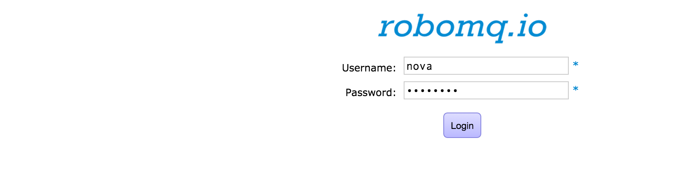
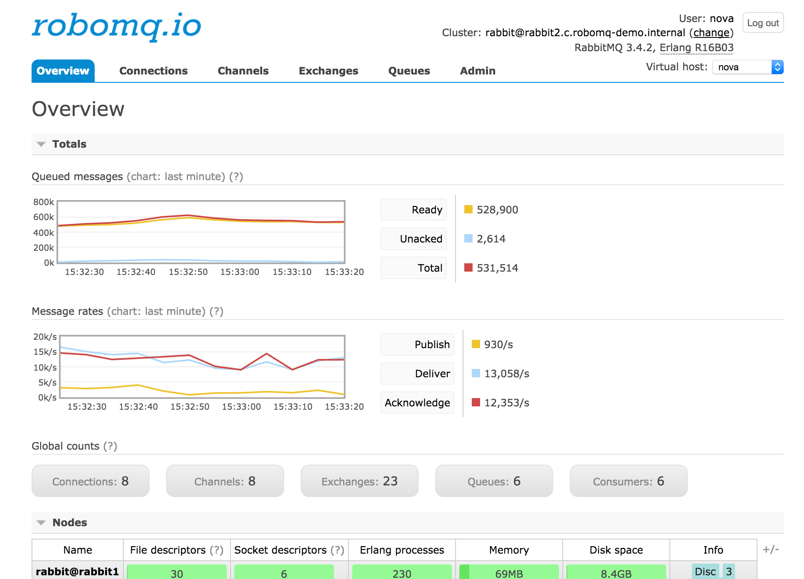
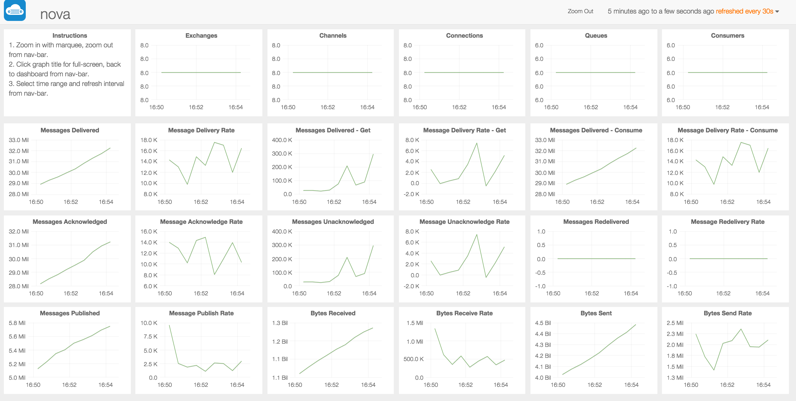

#Getting started 

Getting started with <a href="https://www.robomq.io" target="_blank">RoboMQ.io</a> extremely simple and easy - just sign up for a free trial or if you are ready, contact us to get started on one of the subscription plans.

#Free Trial

To sign up for the free trial of <a href="https://www.robomq.io" target="_blank">RoboMQ.io</a>, click on [Free Trial](http://robomq.io/#free) link. Provide some basic information and some one from robomq.io team will reach out to you with information to get you started.

With the free trial -

1. You do not need to provide any credit card or payment information

2. You get shared tenancy in a full feature cluster supporting all features 

3. except analytics and data driven alert platforms which is based on the content of your data

4. Maximum five (5) concurrent connections to allow you to develop your applications. 

#Subscription plans

If you are ready to get started with a <a href="https://www.robomq.io/#price" target="_blank">paid subscription</a>, reach out to us on our website at <a href="https://www.robomq.io/#contact" target="_blank">Contact us</a> and we will be happy to get you started and setup in couple of hours.

There are following subscription options available:

1. **Shared tenancy** - Shared tenancy on the cloud with your secure virtual host. Available in multiple pricing options of varying size and support levels.

2. **Dedicated cluster** on the cloud - Dedicated tenancy in the cloud with your private robomq clusters. Clusters are built and priced to the required capacity. 

3. **Enterprise hosted** option provides robomq infrastructure hosted on your private cloud or data center as a managed service.

#After you sign up

Once you sign up for the Free trial or one of the subscription plans, you get access to the full feature set of the robomq.io SaaS offering. Following sections explain how to access the components and get started with building your first application. We will illustrate these steps below for a fictional customer named 'nova' with vhost name or tenant ID  'nova'.

##Administrative access to your tenant

Upon sign up, a administrative user and credential token is created for your virtual host on robomq.io cluster.

- **Administrative user** : the user name is same as the vhost or the customer tenant name,  which for this example is **nova**

- **Credential** - administrative credential is a secure token that will be sent over the registered email. This token is one time token generated using TOTP (Time-Based One-Time Password Algorithm) <a href="https://tools.ietf.org/html/rfc6238" target="_blank">IETF RFC 6238</a>.  Every time the token is reset a new token is created.

*Figure : Login credential for robomq Management console*

##Creating additional users and access grants

Additional users can be created with specific passwords or token. Tokens are recommended for security and get be generated for the users using TOTP (Time-Based One-Time Password Algorithm). 

As part of the initial setup, we provide following three users which are sufficient to get the application integration going for most needs.

1. **vhostRead** - The 'vhost' is the customer specific tenant ID. For the example case, the user name will be 'novaRead'. This user has read only access to message, and queues. This user can be used to receive/get messages and act as consumer in the messaging parlance.

2. **vhostWrite** - The 'vhost' is the customer specific tenant ID. For the example case, the user name will be 'novaWrite'. This user has write only access to message, and queues. This user can be used to send/publish messages and act as producer in the messaging parlance.

3. **vhostRW** - The 'vhost' is the customer specific tenant ID. For the example case, the user name will be 'novaRW'. This user has write and read access to message, and queues. This user can be used to send/publish as well as receive/get messages and act as both producer and consumer in the messaging parlance.

*Note: All three above users do not have administrative, management access to the tenant. These users do not have rights to access robomq.io management console.
* 
##Monitoring real time activity of your tenant using Management Console

The real time activities of your tenant can be monitored using the Management Console. The management console provides real time information up to 10 minutes of past activity including messaging activity, connections, channels, exchanges, queues and users. 

For longer horizon messaging traffic activity including visual graphs, robomq Messaging Dashboard should be used. 

*Figure : Monitoring real time activity using robomq Management Console*

##Messaging Dashboard

<a href="https://www.robomq.io" target="_blank">RoboMQ.io</a> messaging dashboard provides specialized visual graphs and charts giving you a single pane of glass, capturing all the messaging activity for your tenant.

The following key messaging activity parameters are tracked in the dashboard:

	1. Exchanges
	2. Connections
	3. Channels
	4. Queues
	5. Consumers
	6. Messages delivered
	7. Message Delivery Rate
	8. Messages Delivered - Get 
	9. Messages Delivery Rate - Get 
	9. Messages Delivered - consume
	10. Messages Delivery Rate - Consume
	11. Messages Acknowledged
	12. Message Acknowledge Rate
	13. Messages Redelivered
	14. Messages Redelivery Rate
	15. Messages Published
	16. Message Publish Rate 
	17. Bytes Received
	18. Byte Receive Rate
	19. Byte Sent
	20. Byte Send Rate

The Messaging dashboard provides historical information for up to 15 days of the messaging activity on your tenant.

*Figure : Messaging Dashboard*

##Analytics and data driven alerts

One of the core strength of the <a href="https://www.robomq.io" target="_blank">RoboMQ.io</a> platform is the expandability. Based on the expandability, we have provided the <a href="https://www.robomq.io/#iotanalytics" target="_blank">IoT Analytics Application</a>. This platforms consume the messages in parallel and provides analytics on it. This functionality is specific use case driven and the some customization is needed to generate required analytics.

*Figure : Analytics based on message content*

Another example of the expandable nature of the <a href="https://www.robomq.io" target="_blank">RoboMQ.io</a> platform is the <a href="https://www.robomq.io/#datadrivenalerts" target="_blank">data driven alerts</a>. It consumes the messages and acts on the message content evaluating them against threshold configuration. When the message content hits these threshold values , a custom alert, email or a phone call can be made to react to this situation. This functionality is also use case specific and needs configuration.

##Writing your first application 

By now you should be familiar with your tenant and all set to start writing your first application using robomq. Follow the sample code and the tutorial in the next section to start sending and receiving  messages in less than 10 lines of code from your devices, sensors and applications !!!!  

##Technical support

Whenever you feel challenged to debug your client program or have technical advice to <a href="https://www.robomq.io" target="_blank">RoboMQ.io</a>, we are ready to solve your problem as soon as possible 7/24.   You can report a issue on our [GitHub](https://github.com/robomq/robomq.io/issues) or directly contact us through Email <info@robomq.io>.
