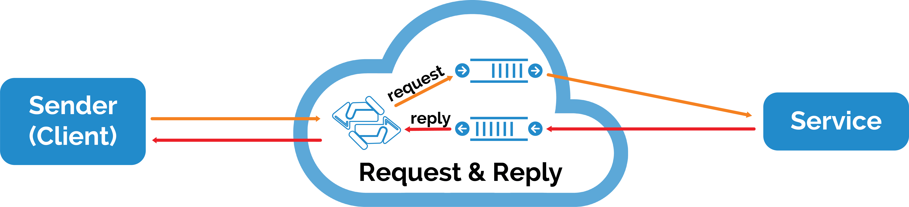

#Request - Reply

This is a two-way message communication also using direct exchange but unlike the RPC pattern, the reply queue is bound to an exchange allowing more than one client to subscribe to and process the replies asynchronously.  In addition any service application can process a request from any client.
In this situation, both producer and consumer are capable of publishing and consuming messages.

## Python

###Producer

For producer, it should initialize an exchange. This exchange can be any type. Or can leave it empty, it will use [robomq.io](http://www.robomq.io) default exchange

	channel.exchange_declare(exchange="exchangeName", type ='direct')

Now producer needs to setup a reply queue for waiting for all replies. 

	channel.queue_declare(queue="replyQueue")

Binding this queue to exchange. 

	channel.queue.bind(exchange="exchangeName", queue="replyQueue", routing_key = "reply")

All the replies with routing key "reply" will get consumed by this producer. Since producer needs to matching each reply to message, we also need to add a correlation_id to each message. 

Using uuid package to generate a random number for correlation_id. 

	corr_id = str(uuid.uuid4())

	def callback(ch, method, props, body):
	if corr_id == props.corrlelaiton_id:
		# acknowledgment for message received. 

Producer should publish the messages to the exchange and wait for consuming the replies. 

	channel.basic_publish(exchange='exchangeName',
                      routing_key=routingKey,
                      body=message)
	channel.basic_consume(callback, no_ack=True,
                                   queue="replyQueue")

Producer will keep waiting for the reply back or killed by interrupted ctrl-C

### Consumer 
For consumer , it should consume the message like the old way. 

	channel.queue_declare(queue='queueName')
	channel.exchange_declare(exchange='exchangeName',type='direct')
	channel.queue_bind(exchange='exchangeName',queue='queueName',routing_key='routingKey')

After consumer got messages, it should send reply back to the producer. So the callback method for basic_consume function should including reply function. 

	def callback(ch, method, props, body):
		ch.basic_publish(exchange='exchangeName',
                     routing_key='reply',
                     properties=pika.BasicProperties(correlation_id = props.correlation_id),
                     body='reply')
		ch.basic_ack(delivery_tag = method.delivery_tag)

Then consumer starts consuming messages. 

	channel.basic_consume(callback, queue="queueName")

###Putting it all together
**producer.py**
 
	import pika
	import uuid

	connection = pika.BlockingConnection(pika.ConnectionParameters(
        host='your host'))

	channel = connection.channel()
	channel.exchange_declare(exchange='exchangeName', type='direct')
	channel.queue_declare(queue='replyQueue')
	channel.queue_bind(exchange='exchangeName', queue='replyQueue', routing_key='reply')
	routingKey = 'routingKey'
	message = 'hello world'

	corr_id = str(uuid.uuid4())
	self.channel.basic_publish(exchange='',
					routing_key='routingKey',
					properties=pika.BasicProperties(
					reply_to = 'replyQueue',
					correlation_id = corr_id,),
					body=str(message))
	print'message sent'
	def callback(ch, method, properties, body):
		print body

	channel.basic_consume(callback,
                      queue='reply',
                      no_ack=True)

	channel.start_consuming()
  
**consumer.py**

	import pika

	connection = pika.BlockingConnection(pika.ConnectionParameters(
        host='your host'))

	channel = connection.channel()

	channel.queue_declare(queue='queueName')
	channel.exchange_declare(exchange='exchangeName',type='direct')
	channel.queue_bind(exchange='exchangeName', queue='queueName', routing_key='routingKey')

	def callback(ch, method, props, body):
		ch.basic_publish(exchange='exchangeName',
									routing_key='reply',
									properties=pika.BasicProperties(correlation_id = props.correlation_id), 
									body='reply')
		ch.basic_ack(delivery_tag = method.delivery_tag)
	channel.basic_consume(callback, queue='queueName')

	print 'Awaiting requests'
	channel.start_consuming()

## Java

###Producer
In this producer, we should including extra package for generate random number. 

	import java.util.UUID;

For producer, it should initialize an exchange. This exchange can be any type. Or can leave it empty, it will use [robomq.io](http://www.robomq.io) default exchange

	channel.exchangeDeclare("exchangeName", "direct");

Now producer needs to setup a reply queue for waiting for all replies. 

	replyQueueName = channel.queueDeclare('replyQueueName', false, false, false, null).getQueue();

Then binding the queue to the exchange with a specific routing key. This key will be the identifier for this queue getting messages form this exchange. If there' no specific binding, there queue will default binding to the default exchange generated by [robomq.io](http://www.robomq.io). We are going to use default exchange. 

All the replies with routing key "reply" will get consumed by this producer. Since producer needs to matching each reply to message, we also need to add a correlation_id to each message. 

Using uuid package to generate a random number for correlation_id. And define all the properties need for reply. Then producer should publish the messages to the exchange and wait for consuming the replies. 

	public String call(String message) throws Exception {
		String response = null;
		String corrId = UUID.randomUUID().toString();
		BasicProperties props = new BasicProperties
		.Builder()
		.correlationId(corrId)
		.replyTo(replyQueueName)
		.build();
		channel.basicPublish('exchangeName', requestQueueName, props, message.getBytes());
		while (true) {
			QueueingConsumer.Delivery delivery = consumer.nextDelivery();
			if (delivery.getProperties().getCorrelationId().equals(corrId)) {
				response = new String(delivery.getBody(),'UTF-8');
				break;
			}
		}
		return response;
	}
Producer will keep waiting for the reply back or killed by interrupted ctrl-C

### Consumer 
For consumer , it should consume the message like the old way. 

	channel.queueDeclare(RPC_QUEUE_NAME, false, false, false, null);
	channel.exchangeDeclare(EXCHANGE_NAME, 'direct');
	String severity = 'routingKey';
	channel.queueBind(RPC_QUEUE_NAME, EXCHANGE_NAME, severity);

After consumer got messages, it should send reply back to the producer. So the callback method for basic_consume function should including reply function. 

Then user can start consuming the message and sending reply back to the producer. 

	while (true) {
		String response = null;
		QueueingConsumer.Delivery delivery = consumer.nextDelivery();
		BasicProperties props = delivery.getProperties();
		BasicProperties replyProps = new BasicProperties
			.Builder()
			.correlationId(props.getCorrelationId())
			.build();
		try {
			String message = new String(delivery.getBody(),'UTF-8');
			int n = Integer.parseInt(message);
			System.out.println('received ' + message);
			response = 'reply';
		}catch (Exception e){
			System.out.println(' [.] ' + e.toString());
			response = 'reply';
		}finally {
			channel.basicPublish( EXCHANGE_NAME, 'reply', replyProps, response.getBytes('UTF-8'));
			channel.basicAck(delivery.getEnvelope().getDeliveryTag(), false);
		}
	}

###Putting it all together
**producer.java**

	import com.rabbitmq.client.ConnectionFactory;
	import com.rabbitmq.client.Connection;
	import com.rabbitmq.client.Channel;
	import com.rabbitmq.client.QueueingConsumer;
	import com.rabbitmq.client.AMQP.BasicProperties;

	import java.util.UUID;
	public class Producer {
	private Connection connection;
	private Channel channel;
	private String requestQueueName = 'queueName';
	private String replyQueueName;
	private QueueingConsumer consumer;
	public Producer() throws Exception {
		ConnectionFactory factory = new ConnectionFactory();
		factory.setHost('your host');
		connection = factory.newConnection();
		channel = connection.createChannel();
		replyQueueName = channel.queueDeclare('replyQueueName', false, false, false, null).getQueue();
		consumer = new QueueingConsumer(channel);
		channel.basicConsume(replyQueueName, true, consumer);
	}
	public String call(String message) throws Exception {
		String response = null;
		String corrId = UUID.randomUUID().toString();
		BasicProperties props = new BasicProperties
		.Builder()
		.correlationId(corrId)
		.replyTo(replyQueueName)
		.build();
		channel.basicPublish('exchangeName', requestQueueName, props, message.getBytes());
		while (true) {
			QueueingConsumer.Delivery delivery = consumer.nextDelivery();
			if (delivery.getProperties().getCorrelationId().equals(corrId)) {
				response = new String(delivery.getBody(),'UTF-8');
				break;
			}
		}
		return response;
	}
	public void close() throws Exception {
		connection.close();
	}
	public static void main(String[] argv) {
		Producer usecase = null;
		String response = null;
		try {
			usecase = new Producer();
			System.out.println('hello world');
			response = usecase.call('hello world');
			System.out.println(response);
		}
		catch (Exception e) {
			e.printStackTrace();
		}
		finally {
			if (usecase!= null) {
				try {
					usecase.close();
				}
					catch (Exception ignore) {}
				}
			}
		}
	}
 
**consumer.java**

	import com.rabbitmq.client.ConnectionFactory;
	import com.rabbitmq.client.Connection;
	import com.rabbitmq.client.Channel;
	import com.rabbitmq.client.QueueingConsumer;
	import com.rabbitmq.client.AMQP.BasicProperties;

	public class Consumer {
	private static final String RPC_QUEUE_NAME = 'queueName';
	private static final String EXCHANGE_NAME = 'exchangeName';

	public static void main(String[] argv) {
		Connection connection = null;
		Channel channel = null;
		try {
			ConnectionFactory factory = new ConnectionFactory();
			factory.setHost('your host');
			connection = factory.newConnection();
			channel = connection.createChannel();
			
			channel.queueDeclare(RPC_QUEUE_NAME, false, false, false, null);
			channel.exchangeDeclare(EXCHANGE_NAME, 'direct');
			String severity = 'routingKey';
			channel.queueBind(RPC_QUEUE_NAME, EXCHANGE_NAME, severity);
			
			QueueingConsumer consumer = new QueueingConsumer(channel);
			channel.basicConsume(RPC_QUEUE_NAME, false, consumer);
			System.out.println('Awaiting requests');
			while (true) {
				String response = null;
				QueueingConsumer.Delivery delivery = consumer.nextDelivery();
				BasicProperties props = delivery.getProperties();
				BasicProperties replyProps = new BasicProperties
				.Builder()
				.correlationId(props.getCorrelationId())
				.build();
				try {
					String message = new String(delivery.getBody(),'UTF-8');
					int n = Integer.parseInt(message);
					System.out.println('received ' + message);
					response = 'reply';
				}
				catch (Exception e){
					System.out.println(' [.] ' + e.toString());
					response = 'reply';
				}
				finally {
					channel.basicPublish( EXCHANGE_NAME, 'reply', replyProps, response.getBytes('UTF-8'));
					channel.basicAck(delivery.getEnvelope().getDeliveryTag(), false);
				}
			}
		}
		catch (Exception e) {
			e.printStackTrace();
		}
		finally {
			if (connection != null) {
				try {
					connection.close();
				}
			catch (Exception ignore) {}
			}
		}
	}
}

## Node.js

###Producer 
In this producer, we should including extra package for generate random number. 

	var uuid = require("node-uuid").v4;
	
For producer, it should initialize an exchange. This exchange can be any type. Or can leave it empty, it will use [robomq.io](http://www.robomq.io) default exchange

	connection.exchange('test-exchange',{type:"direct",autoDelete:false, confirm:true}, function(exchange)

Now producer needs to setup a reply queue for waiting for all replies. 

	replyQueue = connection.queue("Reply",{autoDelete:false});
	replyQueue.bind("test-exchange","Reply");

Then binding the queue to the exchange with a specific routing key. This key will be the identifier for this queue getting messages form this exchange. If there's no specific binding, there queue will default binding to the default exchange generated by [robomq.io](http://www.robomq.io). We are going to use default exchange. 

All the replies with routing key "reply" will get consumed by this producer. Since producer needs to matching each reply to message, we also need to add a correlation_id to each message. 

Using uuid package to generate a random number for correlation_id. And define all the properties need for reply. Then producer should publish the messages to the exchange and wait for consuming the replies. 

	var messageid = uuid();
	console.log('message id is :'+ messageid);
	exchange.publish('routingKey','hello world',{mandatory:true,contentType:'text/plain',replyTo:'Reply',correlationId:messageid},function(message) {
		if (message == false){
			console.log('Client: message has delivered');
			return;
		}
	});	
				

### Consumer
For consumer , it should consume the message like the old way. 

	queue.subscribe(function (message, headers, deliveryInfo, messageObject)

After consumer got messages, it should send reply back to the producer. So the callback method for basic_consume function should including reply function. 

Then user can start consuming the message and sending reply back to the producer. 

	var replyOption = {correlationId:deliveryInfo.correlationId};	exchange.publish("Reply","reply form consumer",replyOption);

###Putting it all together

 **producer.js**

	var amqp = require('amqp');
	var uuid = require('node-uuid').v4;
	var connection = amqp.createConnection({ host: 'your host', port: 'port' });

	connection.on('ready',function(){
		connection.exchange('exchangeName',{type:'direct', autoDelete:false, confirm:true}, function(exchange){
			console.log('start send message');
			replyQueue = connection.queue('Reply',{autoDelete:false});
			replyQueue.bind('exchangeName','Reply');
			var messageid = uuid();
			console.log('message id is :'+ messageid);
			exchange.publish('routingKey','hello world',{mandatory:true,contentType:'text/plain',replyTo:'Reply',correlationId:messageid},function(message) {
				if (message == false){
					console.log('Client: message has delivered');
					return;
				}
			});	
			replyQueue.subscribe(function (message, headers, deliveryInfo, messageObject) {
				console.log('Client: get reply message is \' %s \'', message.data);
			});
		});
	});

 
**consumer.js**

	var amqp = require('amqp');
	var connection = amqp.createConnection({ host: 'your host', port: 'port' });

	connection.on('ready', function(){
		connection.exchange('exchangeName', options={type:'direct', autoDelete:false}, function(exchange){
			var queue = connection.queue('queueName', function(queue){
				console.log('Declare one queue, name is ' + queue.name);
				queue.bind('exchangeName', 'routingKey');
				queue.subscribe(function (message, headers, deliveryInfo, messageObject) {
					console.log('Server: Received message detail as follow:');
					var replyOption = {correlationId:deliveryInfo.correlationId};				
					exchange.publish('Reply','reply form consumer',replyOption);
					console.log('Server has replied');
				});
			});
		});
	});
	
## C
### Prerequisites

**C client AMQP library**

robomq.io is built on AMQP, an open, general-purpose protocol for messaging. There are a number of clients for AMQP in many different languages.  However, we'll choose a simple C-language AMQP client library written for use with v2.0+ of the RabbitMQ broker.

[https://github.com/alanxz/rabbitmq-c/tree/master/librabbitmq](https://github.com/alanxz/rabbitmq-c/tree/master/librabbitmq)

You can copy librabbitmq subfolder from whole repository download based from [https://github.com/alanxz/rabbitmq-c](https://github.com/alanxz/rabbitmq-c)

Alternatively, thanks to Subversion support in GitHub, you can use svn export directly:

	svn export https://github.com/alanxz/rabbitmq-c/trunk/librabbitmq

Copy the librabbitmq package into your working directory:

	cp librabbitmq ./

Note that these examples provide a simple client implementation to get started but does not go into detailed description of all flags passed into the AMQP methods. 
A complete reference to RabbitMQ's implementaton of version 0-9-1 of the AMQP specification can be found in this guide.
[https://www.rabbitmq.com/amqp-0-9-1-reference.html](https://www.rabbitmq.com/amqp-0topic-exchange-9-1-reference.html)

### Producer
For request-reply messaging pattern, the producer also uses **direct** exchange, however, a the reply queue will be created and bound to an exchange allowing more than one consumer to subscribe to and send replies asynchronously. 
Therefore, after publishing a message, the producer will simply wait on a separate queue bound to with with key **"reply_key"** for replies sent by receiving consumer.

	char queue_name[] = "reply-queue";
	char binding_key[] = "reply_key";

	// Declaring exchange
	amqp_exchange_declare(conn, channel, amqp_cstring_bytes(exchange_name), amqp_cstring_bytes(exchange_type),
			passive, durable, auto_delete, internal, amqp_empty_table);

	// Declaring queue
	amqp_queue_declare_ok_t *r = amqp_queue_declare(conn, channel, amqp_cstring_bytes(queue_name),
			passive, durable, exclusive, auto_delete, amqp_empty_table);

	reply_queue = amqp_bytes_malloc_dup(r->queue);

	// Binding to queue
	amqp_queue_bind(conn, channel, reply_queue, amqp_cstring_bytes(exchange_name), amqp_cstring_bytes(binding_key),
			amqp_empty_table);

	// Now wait for the reply message
	amqp_basic_consume(conn, channel, reply_queue, amqp_empty_bytes, no_local, no_ack, exclusive, amqp_empty_table);

	while (1) {
		amqp_rpc_reply_t result;
		amqp_envelope_t envelope;

		amqp_maybe_release_buffers(conn);
		result = amqp_consume_message(conn, &envelope, NULL, 0);

		if (AMQP_RESPONSE_NORMAL == result.reply_type) {

			printf("Received reply message size: %d\nbody: %s\n", envelope.message.body.len, envelope.message.body.bytes);

			amqp_destroy_envelope(&envelope);
		}
	}

### Consumer
This consumer after successfully receiving message from producer will simply send a reply with routing key **"reply_key"** indicating that exchange will deliver reply directly to the reply queue subscribed to by the producer.

	char routing_key[] = "reply_key";
	result = amqp_consume_message(conn, &envelope, NULL, 0);

	if (AMQP_RESPONSE_NORMAL == result.reply_type) {

		// Now sending reply
		amqp_basic_publish(conn,
				channel,
				amqp_cstring_bytes(exchange_name),
				amqp_cstring_bytes(routing_key),
				0,
				0,
				&props,
				amqp_cstring_bytes("Hello back at you"));

		amqp_destroy_envelope(&envelope);
	}

At this point, consumer should start consuming messages.

### How to build/run client
Now we have two c files, one is producer.c, another is consumer.c. 
(1) Use the Makefile in sdk repository to compile under a Linux terminal. 
(2) cd to the directory which containing client source code 
(3) Run make all

### Putting it all together
The full code below includes some basic AMQP error handling for consumer that is useful when declaring exchanges and queues.  In addition, main receiver loop attempts to reconnect upon network connection failure.

**producer.c**

	#include <stdlib.h>
	#include <stdio.h>
	#include <string.h>
	
	#include <amqp_tcp_socket.h>
	#include <amqp.h>
	#include <amqp_framing.h>
	
	amqp_connection_state_t mqconnect() {
	
		amqp_connection_state_t conn = amqp_new_connection();
		amqp_socket_t *socket = NULL;
		char hostname[] = "hostname"; // robomq.io hostname
		int port = 5672; //default
		char user[] = "username"; // robomq.io username
		char password[] = "password"; // robomq.io password
		char vhost[] = "vhost"; // robomq.io account vhost
		amqp_channel_t channel = 1;
		int channel_max = 0;
		int frame_max = 131072;
		int heartbeat = 0;
		int status = 0;
	
		// Opening socket
		socket = amqp_tcp_socket_new(conn);
	
		status = amqp_socket_open(socket, hostname, port);
		if (status) {
			printf("Error opening TCP socket, status = %d, exiting.", status);
		}
	
		amqp_login(conn, vhost, channel_max, frame_max, heartbeat, AMQP_SASL_METHOD_PLAIN, user, password);
		amqp_channel_open(conn, channel);
	
		return conn;
	}
	
	amqp_bytes_t mqdeclare(amqp_connection_state_t conn) {
		amqp_bytes_t queue;
		amqp_channel_t channel = 1;
		amqp_boolean_t passive = 0;
		amqp_boolean_t durable = 0;
		amqp_boolean_t exclusive = 0;
		amqp_boolean_t auto_delete = 1;
		amqp_boolean_t internal = 0;
		char exchange_name[] = "hello-exchange";
		char exchange_type[] = "direct";
		char queue_name[] = "reply-queue";
		char binding_key[] = "reply_key";
		amqp_rpc_reply_t reply;
	
		// Declaring exchange
		amqp_exchange_declare(conn, channel, amqp_cstring_bytes(exchange_name), amqp_cstring_bytes(exchange_type),
			passive, durable, auto_delete, internal, amqp_empty_table);
	
		reply = amqp_get_rpc_reply(conn);
		if(reply.reply_type != AMQP_RESPONSE_NORMAL) {
			amqp_connection_close_t *m = (amqp_connection_close_t *) reply.reply.decoded;
			fprintf(stderr, "%s: server connection error %d, message: %.*s\n",
					"Error declaring exchange",
					m->reply_code,
					(int) m->reply_text.len, (char *) m->reply_text.bytes);
			exit(1);
		}
	
		// Declaring queue
		amqp_queue_declare_ok_t *r = amqp_queue_declare(conn, channel, amqp_cstring_bytes(queue_name),
				passive, durable, exclusive, auto_delete, amqp_empty_table);
	
		reply = amqp_get_rpc_reply(conn);
		if(reply.reply_type != AMQP_RESPONSE_NORMAL) {
			amqp_connection_close_t *m = (amqp_connection_close_t *) reply.reply.decoded;
					fprintf(stderr, "%s: server connection error %d, message: %.*s\n",
							"Error declaring queue",
							m->reply_code,
							(int) m->reply_text.len, (char *) m->reply_text.bytes);
			exit(1);
		}
		queue = amqp_bytes_malloc_dup(r->queue);
	
		// Binding to queue
		amqp_queue_bind(conn, channel, queue, amqp_cstring_bytes(exchange_name), amqp_cstring_bytes(binding_key),
				amqp_empty_table);
	
		return queue;
	}
	
	int main(int argc, char const *const *argv)
	{
		amqp_connection_state_t conn;
		amqp_bytes_t reply_queue;
		amqp_channel_t channel = 1;
		amqp_basic_properties_t props;
		props._flags = AMQP_BASIC_CONTENT_TYPE_FLAG | AMQP_BASIC_DELIVERY_MODE_FLAG;
		props.content_type = amqp_cstring_bytes("text/plain");
		props.delivery_mode = 1; /* non-persistent delivery mode */
		amqp_boolean_t mandatory = 0;
		amqp_boolean_t immediate = 0;
		amqp_boolean_t no_local = 0;
		amqp_boolean_t no_ack = 1;
		amqp_boolean_t exclusive = 0;
		char exchange_name[] = "hello-exchange";
		char routing_key[] = "request_key";
		int result;
	
		conn = mqconnect();
		reply_queue = mqdeclare(conn);
	
		// Sending message
		result = amqp_basic_publish(conn,
				channel,
				amqp_cstring_bytes(exchange_name),
				amqp_cstring_bytes(routing_key),
				mandatory,
				immediate,
				&props,
				amqp_cstring_bytes("Hello"));
	
		// Now wait for the reply message
		amqp_basic_consume(conn, channel, reply_queue, amqp_empty_bytes, no_local, no_ack, exclusive, amqp_empty_table);
	
		while (1) {
			amqp_rpc_reply_t result;
			amqp_envelope_t envelope;
	
			amqp_maybe_release_buffers(conn);
			result = amqp_consume_message(conn, &envelope, NULL, 0);
	
			if (AMQP_RESPONSE_NORMAL == result.reply_type) {
	
				printf("Received reply message size: %d\nbody: %s\n", envelope.message.body.len, envelope.message.body.bytes);
	
				amqp_destroy_envelope(&envelope);
			}
		}
	
		// Closing connection
		amqp_channel_close(conn, channel, AMQP_REPLY_SUCCESS);
		amqp_connection_close(conn, AMQP_REPLY_SUCCESS);
		amqp_destroy_connection(conn);
	
		return 0;
	}

**consumer.c**

	#include <stdlib.h>
	#include <stdio.h>
	#include <string.h>
	
	#include <amqp_tcp_socket.h>
	#include <amqp.h>
	#include <amqp_framing.h>
	
	amqp_connection_state_t mqconnect() {
	
		amqp_connection_state_t conn = amqp_new_connection();
		amqp_socket_t *socket = NULL;
		char hostname[] = "hostname"; // robomq.io hostname
		int port = 5672; //default
		char user[] = "username"; // robomq.io username
		char password[] = "password"; // robomq.io password
		char vhost[] = "vhost"; // robomq.io account vhost
		amqp_channel_t channel = 1;
		amqp_rpc_reply_t reply;
		int channel_max = 0;
		int frame_max = 131072;
		int heartbeat = 0;
		int status = 0;
	
		// Opening socket
		socket = amqp_tcp_socket_new(conn);
	
		status = amqp_socket_open(socket, hostname, port);
		if (status) {
			printf("Error opening TCP socket, status = %d\n", status);
		}
	
		reply = amqp_login(conn, vhost, channel_max, frame_max, heartbeat, AMQP_SASL_METHOD_PLAIN, user, password);
		if(reply.reply_type != AMQP_RESPONSE_NORMAL) {
			fprintf(stderr, "%s: server connection reply code: %d\n",
					"Error logging in", reply.reply_type);
		}
	
		amqp_channel_open(conn, channel);
	
		return conn;
	}
	
	amqp_bytes_t mqdeclare(amqp_connection_state_t conn, const char *exchange_name, const char *queue_name) {
		amqp_bytes_t queue;
		amqp_channel_t channel = 1;
		amqp_boolean_t passive = 0;
		amqp_boolean_t durable = 0;
		amqp_boolean_t exclusive = 0;
		amqp_boolean_t auto_delete = 1;
		amqp_boolean_t internal = 0;
		char exchange_type[] = "direct";
		char binding_key[] = "request_key";
		amqp_rpc_reply_t reply;
	
		// Declaring exchange
		amqp_exchange_declare(conn, channel, amqp_cstring_bytes(exchange_name), amqp_cstring_bytes(exchange_type),
				passive, durable, auto_delete, internal, amqp_empty_table);
	
		reply = amqp_get_rpc_reply(conn);
		if(reply.reply_type != AMQP_RESPONSE_NORMAL) {
			amqp_connection_close_t *m = (amqp_connection_close_t *) reply.reply.decoded;
			if(NULL != m) {
				fprintf(stderr, "%s: server connection error %d, message: %.*s\n",
						"Error declaring exchange",
						m->reply_code,
						(int) m->reply_text.len, (char *) m->reply_text.bytes);
			}
		}
	
		// Declaring queue
		amqp_queue_declare_ok_t *r = amqp_queue_declare(conn, channel, amqp_cstring_bytes(queue_name),
				passive, durable, exclusive, auto_delete, amqp_empty_table);
	
		reply = amqp_get_rpc_reply(conn);
		if(reply.reply_type != AMQP_RESPONSE_NORMAL) {
			fprintf(stderr, "%s: server connection reply code: %d\n",
					"Error declaring queue", reply.reply_type);
		}
		else {
			queue = amqp_bytes_malloc_dup(r->queue);
	
			// Binding to queue
			amqp_queue_bind(conn, channel, queue, amqp_cstring_bytes(exchange_name), amqp_cstring_bytes(binding_key),
					amqp_empty_table);
		}
	
		return queue;
	}
	
	int main(int argc, char const *const *argv)
	{
		amqp_connection_state_t conn;
		amqp_bytes_t queue;
		amqp_channel_t channel = 1;
		amqp_boolean_t no_local = 0;
		amqp_boolean_t no_ack = 1;
		amqp_boolean_t exclusive = 0;
		char exchange_name[] = "hello-exchange";
		char routing_key[] = "reply_key";
		amqp_basic_properties_t props;
		props._flags = AMQP_BASIC_CONTENT_TYPE_FLAG | AMQP_BASIC_DELIVERY_MODE_FLAG;
		props.content_type = amqp_cstring_bytes("text/plain");
		props.delivery_mode = 1; /* non-persistent delivery mode */
		char queue_name[] = "hello-queue";
		int retry_time = 5; // retry time in seconds
	
		conn = mqconnect();
		queue = mqdeclare(conn, &exchange_name[0], &queue_name[0]);
	
		// Consuming the message
		amqp_basic_consume(conn, channel, queue, amqp_empty_bytes, no_local, no_ack, exclusive, amqp_empty_table);
	
		while (1) {
			amqp_rpc_reply_t result;
			amqp_envelope_t envelope;
	
			amqp_maybe_release_buffers(conn);
			result = amqp_consume_message(conn, &envelope, NULL, 0);
	
			if (AMQP_RESPONSE_NORMAL != result.reply_type) {
				printf("Consumer AMQP failure occurred, response code = %d, retrying in %d seconds...\n",
						result.reply_type, retry_time);
	
				conn = mqconnect();
				amqp_queue_bind(conn, channel, queue, amqp_cstring_bytes(exchange_name), amqp_cstring_bytes(queue_name),
						amqp_empty_table);
	
				queue = mqdeclare(conn, &exchange_name[0], &queue_name[0]);
				amqp_basic_consume(conn, channel, queue, amqp_empty_bytes, no_local, no_ack, exclusive, amqp_empty_table);
				sleep(retry_time);
			}
			else {
				printf("Received message size: %d\nbody: %s\n", envelope.message.body.len, envelope.message.body.bytes);
	
				// Now sending reply
				amqp_basic_publish(conn,
						channel,
						amqp_cstring_bytes(exchange_name),
						amqp_cstring_bytes(routing_key),
						0,
						0,
						&props,
						amqp_cstring_bytes("Hello back at you"));
	
				amqp_destroy_envelope(&envelope);
			}
		}
	
		// Closing connection
		amqp_channel_close(conn, channel, AMQP_REPLY_SUCCESS);
		amqp_connection_close(conn, AMQP_REPLY_SUCCESS);
		amqp_destroy_connection(conn);
	
		return 0;
	}

 